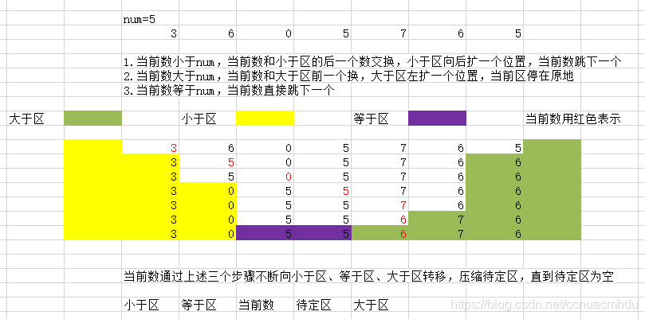
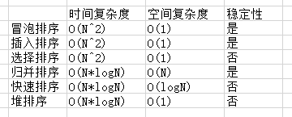
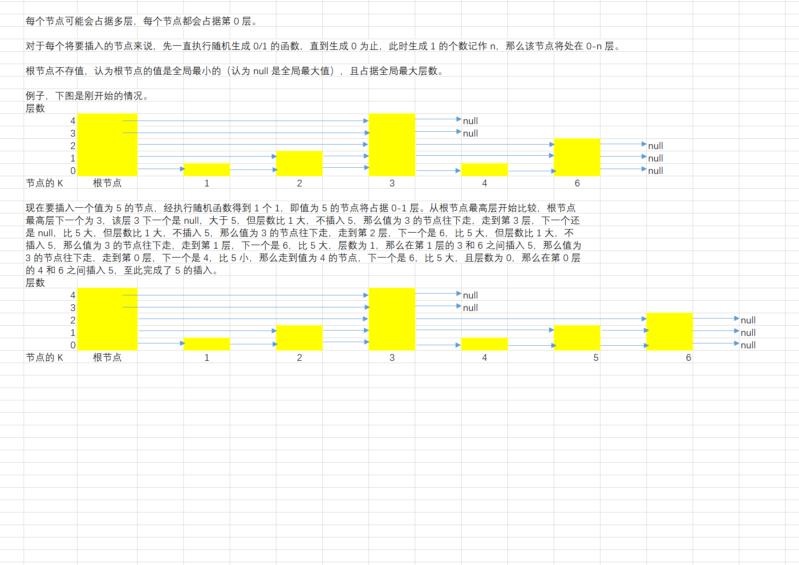

# algorithm-learning-examples
# 算法学习篇
## 1 排序
快速排序思路过程详细图解
   
各种排序复杂度稳定性比较 

#### 1.1 常见排序汇总
com.example.sort.Sort
#### 1.2 小和问题
com.example.sort.SmallSumProblem
#### 1.3 逆序对问题
com.example.sort.ReversePairProblem

## 2 二分查找
com.example.binarySearch.BinarySearch
#### 2.1 查找有序数组大于等于某数的最左位置
com.example.binarySearch.BinarySearchExample01
#### 2.2 局部最小值问题
com.example.binarySearch.BinarySearchExample02

## 3 贪心
#### 3.1 字符串拼接问题
com.example.greedy.GreedyExample01
#### 3.2 金条分割问题
com.example.greedy.GreedyExample02
#### 3.3 安排最多的项目问题
com.example.greedy.GreedyExample03
#### 3.4 数据流中随时可取得中位数问题
com.example.greedy.GreedyExample04
#### 3.5 项目利润最大问题
com.example.greedy.GreedyExample05

## 4 跳表
com.example.skipList.SkipList  
跳表图解

# 剑指 Offer
### 表示数值的字符串
com.example.offer.OfferProblem01  
表示数值的自动机图解（图片来自 Leetcode 中国站点）

# Leetcode 刷题篇

### 51 N 皇后
com.example.leetcode.leetcode_51
### 257 二叉树的所有路径
com.example.leetcode.Leetcode_257
### 60 第 k 个排列
com.example.leetcode.Leetcode_60
### 107 二叉树的层次遍历 II
com.example.leetcode.Leetcode_107
### 347 前 K 个高频元素
com.example.leetcode.Leetcode_347
### 77 组合
com.example.leetcode.Leetcode_77
### 39 组合总和
com.example.leetcode.Leetcode_39
### 40 组合总和 II
com.example.leetcode.Leetcode_40
### 216 组合总和 III
com.example.leetcode.Leetcode_216
### 637 二叉树的层平均值
com.example.leetcode.Leetcode_637
### LCP 19 秋叶收藏集
com.example.leetcode.Leetcode_LCP_19
### 79 单词搜索
com.example.leetcode.Leetcode_79
### LCP 20 快速公交
com.example.leetcode.Leetcode_LCP_20
### 37 解数独
com.example.leetcode.Leetcode_37
### 226 翻转二叉树
com.example.leetcode.Leetcode_226
### LCP 21 追逐游戏
com.example.leetcode.Leetcode_LCP_21
### 47 全排列 II
com.example.leetcode.Leetcode_47
### 404 左叶子之和
com.example.leetcode.Leetcode_404
### 685 冗余连接 II
com.example.leetcode.Leetcode_685
### 78 子集
com.example.leetcode.Leetcode_78
### 5505 所有排列中的最大和
com.example.leetcode.Leetcode_5505
### 5521 矩阵的最大非负积
com.example.leetcode.Leetcode_5521
### 5520 拆分字符串使唯一子字符串的数目最大
com.example.leetcode.Leetcode_5520
### 538 把二叉搜索树转换为累加树
com.example.leetcode.Leetcode_538
### 968 监控二叉树
com.example.leetcode.Leetcode_968
### 617 合并二叉树
com.example.leetcode.Leetcode_617
### 501 二叉搜索树中的众数
com.example.leetcode.Leetcode_501
### 106 从中序与后序遍历序列构造二叉树
com.example.leetcode.Leetcode_106
### 113 路径总和 II
com.example.leetcode.Leetcode_113
### 235 二叉搜索树的最近公共祖先
com.example.leetcode.Leetcode_235
### 117 填充每个节点的下一个右侧节点指针 II
com.example.leetcode.Leetcode_117

# 《程序员代码面试指南（第2版）》学习篇
特别说明，本部分是笔者学习左程云著作《程序员代码面试指南》的笔记，并使用[牛客网独家OJ刷题](https://www.nowcoder.com/ta/programmer-code-interview-guide)
## 学习本书方法思考
- 个人觉得这本书非常好，是最好的面试刷题资料
- 本书缺点是文字叙述太多，文字缺乏直观性，没有视频，理解费时，可以搜网上帖子帮助理解
- 可以适当跳过一些过难的题，节约刷题时间
- 结合Leetcode题解，特别是评论区热心网友的贴心代码注释+解释

## 第 1 章 栈和队列
#### 设计一个有 getMin 功能的栈
com.example.codeinterview.chapter01.Code_01_01
#### 由两个栈组成的队列
com.example.codeinterview.chapter01.Code_01_02
#### 如何仅用递归函数和栈操作逆序一个栈
com.example.codeinterview.chapter01.Code_01_03
#### 猫狗队列
com.example.codeinterview.chapter01.Code_01_04
#### 用一个栈实现另一个栈的排序
com.example.codeinterview.chapter01.Code_01_05
#### 用栈来求解汉诺塔问题
com.example.codeinterview.chapter01.Code_01_06
#### 生成窗口最大值数组
com.example.codeinterview.chapter01.Code_01_07
#### 单调栈结构
com.example.codeinterview.chapter01.Code_01_08
#### 求最大子矩阵的大小
com.example.codeinterview.chapter01.Code_01_09
#### 最大值减去最小值小于或等于 num 的子数组数量
com.example.codeinterview.chapter01.Code_01_10
#### 可见的山峰对数量
com.example.codeinterview.chapter01.Code_01_11

## 第 2 章 链表问题
#### 打印两个有序链表的公共部分
com.example.codeinterview.chapter02.Code_02_01
#### 在单链表和双链表中删除倒数第 K 个节点
com.example.codeinterview.chapter02.Code_02_02
#### 在单链表和双链表中删除第 K 个节点
com.example.codeinterview.chapter02.Code_02_03
#### 反转单向和双向链表
com.example.codeinterview.chapter02.Code_02_04
#### 反转部分单向链表
com.example.codeinterview.chapter02.Code_02_05
#### 环形单链表的约瑟夫问题
com.example.codeinterview.chapter02.Code_02_06
#### 判断一个链表是否为回文结构
com.example.codeinterview.chapter02.Code_02_07
#### 将单向链表按某值划分成左边小、中间相等、右边大的形式
com.example.codeinterview.chapter02.Code_02_08
#### 复制含有随机指针节点的链表
com.example.codeinterview.chapter02.Code_02_09
#### 两个单链表生成相加链表
com.example.codeinterview.chapter02.Code_02_10
#### 两个单链表相交的一系列问题
com.example.codeinterview.chapter02.Code_02_11
#### 将单链表的每 K 个节点之间逆序
com.example.codeinterview.chapter02.Code_02_12
#### 删除无序单链表中值重复出现的节点
com.example.codeinterview.chapter02.Code_02_13
#### 在单链表中删除指定值的节点
com.example.codeinterview.chapter02.Code_02_14
#### 将搜索二叉树转换成双向链表
com.example.codeinterview.chapter02.Code_02_15
#### 单链表的选择排序
com.example.codeinterview.chapter02.Code_02_16
#### 一种怪异的节点删除方式
com.example.codeinterview.chapter02.Code_02_17
#### 向有序的环形单链表中插入新节点
com.example.codeinterview.chapter02.Code_02_18
#### 合并两个有序链表
com.example.codeinterview.chapter02.Code_02_19
#### 按照左右半区的方式重新组合单链表
com.example.codeinterview.chapter02.Code_02_20

## 第 3 章 二叉树问题
#### 分别用递归和非递归方式实现二叉树先序、中序和后序遍历
com.example.codeinterview.chapter03.Code_03_01
#### 打印二叉树的边界节点
com.example.codeinterview.chapter03.Code_03_02
#### 如何较为直观地打印二叉树
com.example.codeinterview.chapter03.Code_03_03
#### 二叉树的序列化和反序列化
com.example.codeinterview.chapter03.Code_03_04
#### 在二叉树中找到累加和为指定值的最长路径长度
com.example.codeinterview.chapter03.Code_03_05